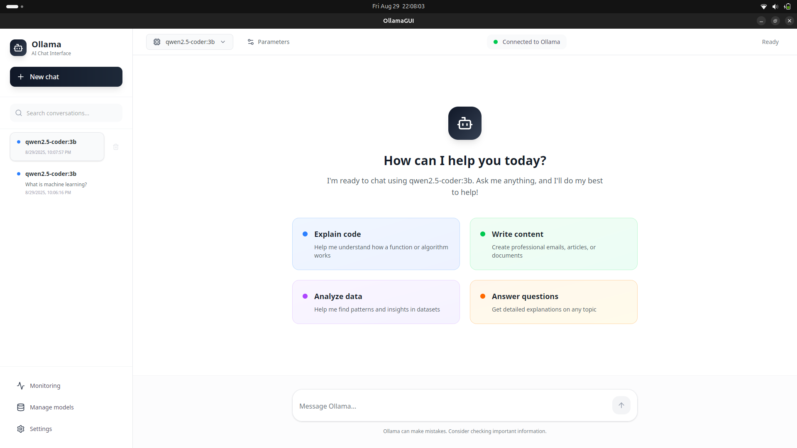
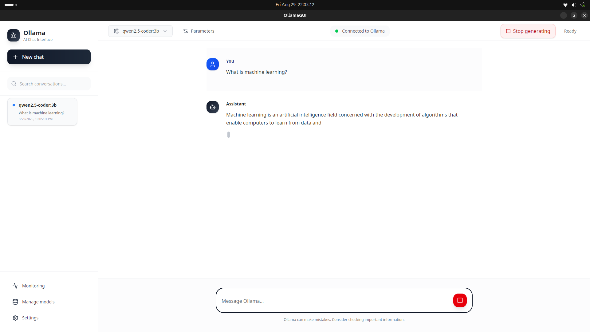
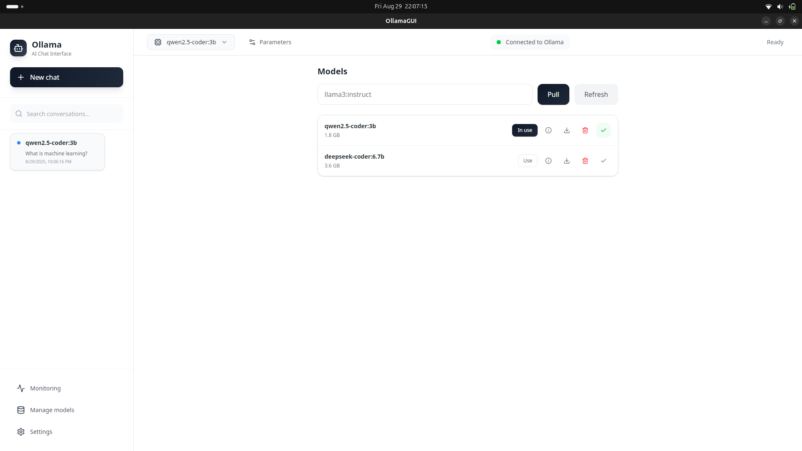
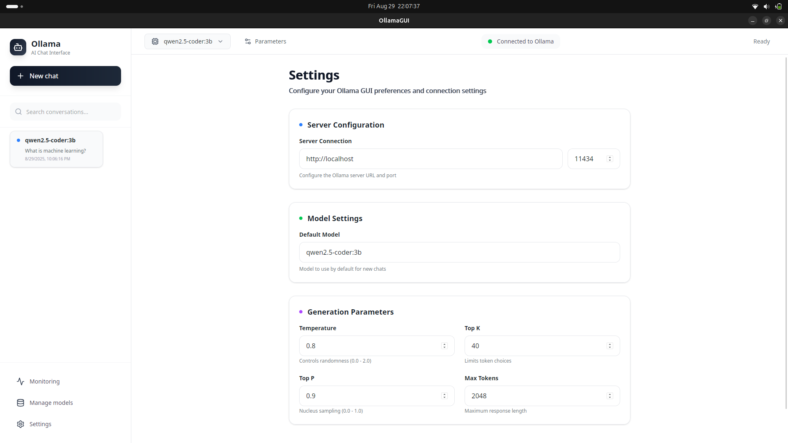

# Ollama Linux GUI (Tauri + React)

A fast, Linux‑native desktop GUI for Ollama with streaming chat, clean white UI, model management, and local persistence. Built with Tauri 2 (Rust) and React + TypeScript.

## About

OllamaGUI is a lightweight, privacy‑first desktop app for chatting with local Ollama models on Linux. It brings a clean, ChatGPT‑style experience with streaming replies, Markdown rendering, terminal‑style code blocks, and simple model management—no CLI commands required.

## Install (Linux AppImage)

Download the latest AppImage from the Releases page, make it executable, and run it:

```bash
wget -O OllamaGUI.AppImage https://github.com/MedGm/OllamaGUI/releases/latest/download/OllamaGUI_*_amd64.AppImage
chmod +x OllamaGUI.AppImage
./OllamaGUI.AppImage
```

Requirements: the Ollama daemon running locally (default http://localhost:11434).

## Motivation

Ollama’s official desktop app is available on Windows and macOS, while Linux users have primarily had the CLI. This project provides a simple, polished GUI for Linux (e.g., Ubuntu) so you can use Ollama comfortably without memorizing commands.

## Screenshots






## Features

- Chat with local Ollama models
  - Streaming responses with Stop button
  - ChatGPT‑style Markdown rendering
  - Terminal‑styled code blocks with copy
  - Per‑chat model association and history
- Models management
  - List installed models
  - Pull with live progress
  - Show model info, delete
- Settings
  - Server URL/port, theme, defaults
  - Persisted locally
- Persistence (SQLite)
  - Chats and messages stored in `~/.config/ollama-gui/app.db`
  - Cascade delete; auto refresh sidebar

## Prerequisites

- Linux (Wayland/X11)
- Ollama daemon installed and running (default http://localhost:11434)
- Rust toolchain (for Tauri 2) and system deps
- Node.js 18+ (Vite + React)

## Project structure

```
/ollama-gui/
  app/                 # React + TypeScript frontend
  src-tauri/           # Tauri 2 (Rust) backend
```

Frontend tech: React 19, Zustand, Tailwind CSS v4, lucide-react, react-markdown, remark‑gfm, rehype‑highlight

Backend tech: Tauri 2, reqwest, tokio, sqlx (SQLite), serde, uuid

## Architecture

This project follows a thin‑frontend / native‑bridge model where React drives the UI while Tauri (Rust) owns streaming, persistence, and OS integration.

### Layers

- UI (WebView): React + TypeScript + Tailwind
  - Presentation: components under `app/src/components/`
  - State: Zustand stores under `app/src/store/`
  - Markdown renderer: `app/src/lib/markdown.tsx`
- Native (Tauri 2, Rust): `src-tauri/src/`
  - HTTP client to Ollama (reqwest)
  - SQLite persistence (sqlx)
  - Commands (IPC) exposed to the UI

### Module map

- `src-tauri/src/commands/chat.rs` — chat streaming (`chat_stream`), abort (`abort_chat`)
- `src-tauri/src/commands/models.rs` — models list/pull/delete/show
- `src-tauri/src/commands/settings.rs` — settings get/set (JSON on disk)
- `src-tauri/src/commands/db.rs` — chats/messages CRUD and helpers
- `src-tauri/src/db/mod.rs` — SQLite init (WAL, foreign_keys), connection setup
- `app/src/store/chatStore.ts` — chat orchestration, streaming lifecycle
- `app/src/store/modelsStore.ts` — models list/pull progress, delete/show
- `app/src/store/settingsStore.ts` — persisted settings state + IPC sync
- `app/src/components/*` — TopBar, Sidebar, MainPanel, Message, ModelPicker, etc.

### IPC surface (Tauri commands)

- System
  - `server_health(url?)` → { connected, url, error? }
- Chat
  - `chat_stream({ model, messages, params? })` → emits events (see below)
  - `abort_chat()` → cancel current stream
- Models
  - `models_list()` → { models: [...] }
  - `model_pull({ name })` → emits pull progress events
  - `model_delete({ name })` → boolean
  - `model_show({ name })` → model details
- Settings
  - `settings_get()` / `settings_set({...})`
- Database (SQLite)
  - `db_create_chat({ model?, systemPrompt?, paramsJson? })` → ChatMeta
  - `db_append_message({ chatId, role, content, metaJson? })` → MessageRow
  - `db_list_chats({ limit? })` → ChatMeta[]
  - `db_list_chats_with_flags({ limit? })` → ChatMeta[] with `has_messages`
  - `db_list_messages({ chatId, limit? })` → MessageRow[]
  - `db_delete_chat({ chatId })` → boolean
  - `db_set_chat_model({ chatId, model })` → boolean

### Events

- Chat stream: `chat:stream-start`, `chat:chunk`, `chat:complete`, `chat:error`, `chat:cancelled` (correlated via `stream_id`)
- Model pull: `models:pull-start`, `models:pull-progress`, `models:pull-complete`, `models:pull-error`
- UI refresh: custom browser event `chats-refresh` (after message save / chat changes)

### Key data flows

1) Chat generation
```
UI → invoke('chat_stream', { model, messages, params })
Rust → POST http://127.0.0.1:11434/api/chat (stream: true)
Rust → emit NDJSON chunks as chat:* events
UI → append tokens to the in‑flight assistant message; allow abort via abort_chat
```

2) Model pull
```
UI → invoke('model_pull', { name })
Rust → POST /api/pull (stream progress)
Rust → emit models:pull-* events (start/progress/complete/error)
UI → update progress bar; merge into models list on completion
```

3) Persistence
```
UI → invoke('db_create_chat') / invoke('db_append_message')
Rust → sqlx (SQLite) write; cascade rules for delete
UI → refresh sidebar via 'chats-refresh'
```

### Persistence design (SQLite)

- Location: `~/.config/ollama-gui/app.db`
- Pragmas: WAL mode, `PRAGMA foreign_keys=ON`
- Tables (simplified):
  - `chats(id, created_at, updated_at, model, system_prompt, params_json)`
  - `messages(id, chat_id, role, content, created_at, meta_json) ON DELETE CASCADE`

### Streaming implementation notes

- Rust uses `reqwest` streaming + line splitting for NDJSON
- Each event carries `stream_id` to correlate UI listeners
- UI registers listeners before `invoke('chat_stream')` and cleans up on complete/cancel

### Security & privacy

- Default connectivity is localhost (`http://localhost:11434`)
- CSP is controlled via Tauri; file and network access only via registered commands
- No telemetry in V1; settings stored locally under `~/.config/ollama-gui/`

### Observability

- Structured logging on the Rust side via `tauri-plugin-log`
- Frontend minimal console diagnostics; errors surfaced in UI where applicable

## Getting started (dev)

1) Install dependencies
- Rust toolchain (https://rustup.rs)
- Node.js (https://nodejs.org)
- Tauri system deps (https://tauri.app/start/prerequisites/)

2) Start Ollama
- Make sure the daemon is running locally on port 11434

3) Run the app in dev
- From the repo root:
  - The Tauri config runs `npm run dev` inside `app/` automatically
  - Start Tauri dev:

```
cargo tauri dev
```

This starts Vite on 5173 and launches the Tauri window.

## Build

From repo root, build the frontend and bundle the desktop app:

```
cargo tauri build
```

Artifacts will be under `src-tauri/target/` (AppImage/deb depending on host).

## Configuration & Data

- Settings JSON: `~/.config/ollama-gui/settings.json`
- SQLite DB: `~/.config/ollama-gui/app.db`
  - WAL mode and foreign keys enabled
  - Chats/messages with ON DELETE CASCADE

## Keyboard

- Enter: send
- Shift+Enter: newline

## Notes

- The app talks only to localhost by default. You can change the server in Settings.
- If you see database “unable to open” errors, ensure the config directory and file are created; the app now auto-creates them and uses a `sqlite://...app.db?mode=rwc` URL.

## Roadmap (short)

- Chat subtitles & auto‑title from first user line
- Markdown polish (tables/quotes), copy whole message
- Optional cancel model pull
- Packaging: Flatpak / AppImage pipelines

## License

This project is licensed under the MIT License - see the [LICENSE](LICENSE) file for details.


## Publish to GitHub

1) Create a new repo on GitHub (without initializing files).
2) In your local project root, run:

```bash
git init
git add .
git commit -m "Initial commit"
git branch -M main
git remote add origin git@github.com:<your-username>/<your-repo>.git
git push -u origin main
```

Then drag your screenshots into `docs/screenshots/` and push again so the images appear in the README.
